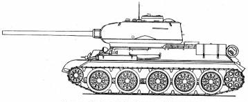

# Tanks documentation

## T-34-85

- WW2 (Soviet Union)
- Production: 1940-1945
- Technical information
  - Peso	26-30,9 t 
  - Longitud	6,75 m
  - Anchura	3,6 m
  - Altura	2,45 m
  - Tripulación	4
  - Velocity
    - over road: 55 km/h
    - over field: 26-40 km/h
  - firepower cannon: 85 mm
- [wiki link](https://es.wikipedia.org/wiki/T-34)
